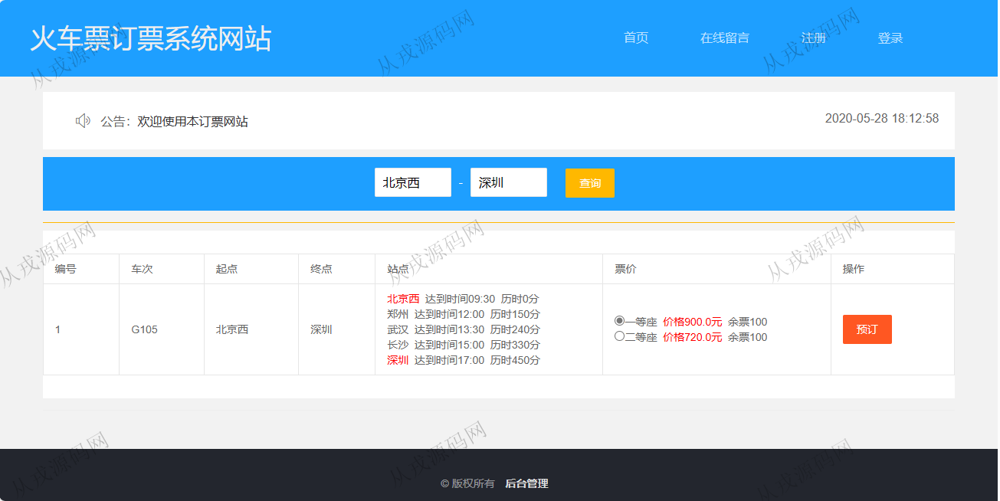
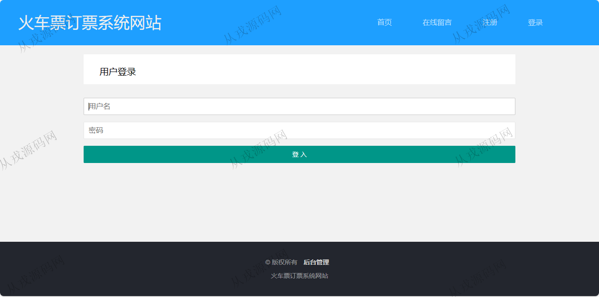
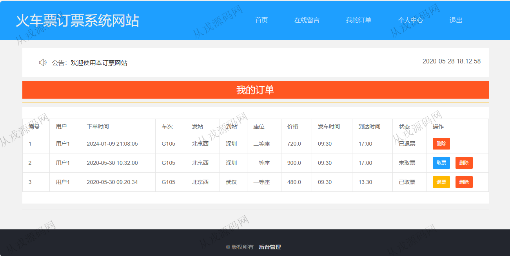
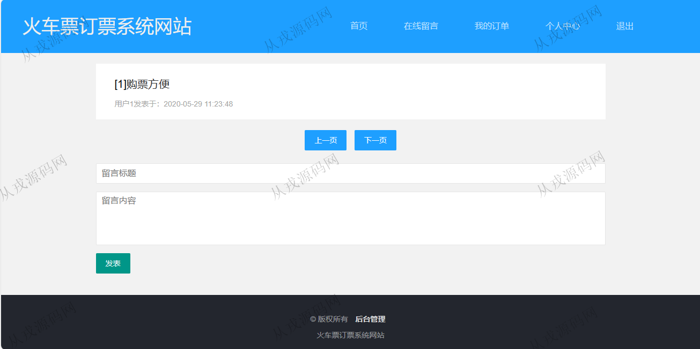
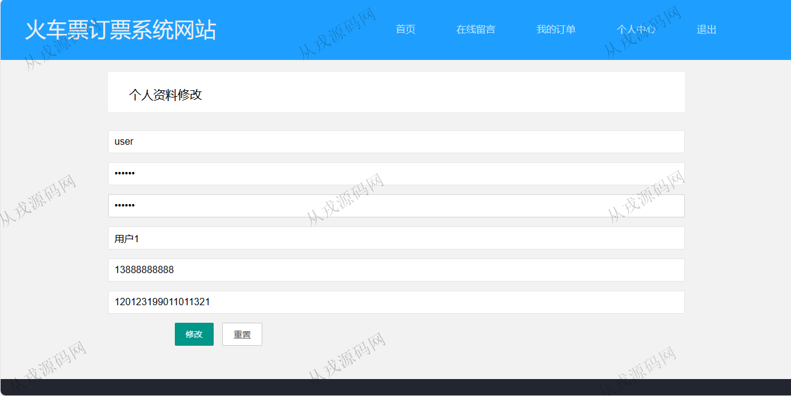
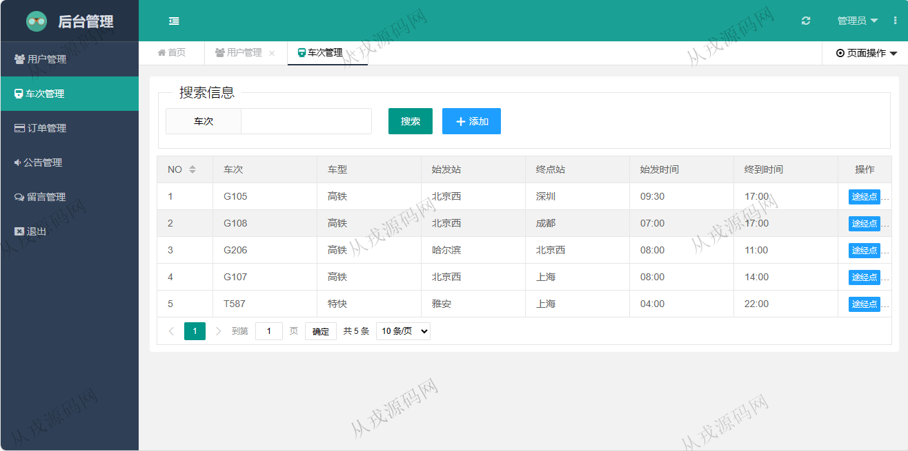
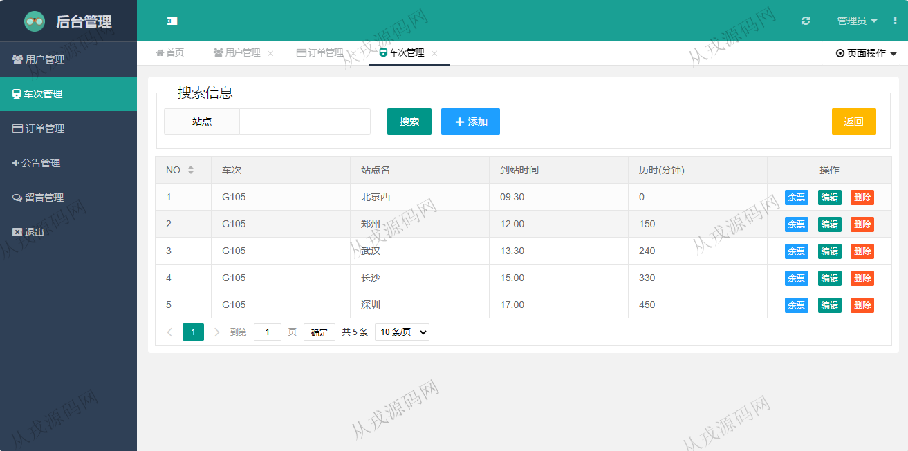
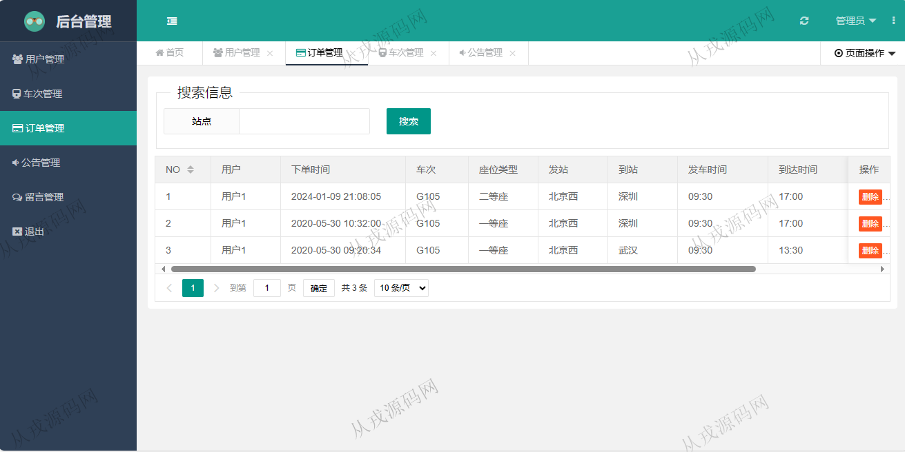

<h1 align="center">134.火车票订票管理系统</h1>

- <b>完整代码获取地址：从戎源码网 ([https://armycodes.com/](https://armycodes.com/))</b>
- <b>技术探讨、资料分享，请加QQ群：692619798</b> 
- <b>作者微信：19941326836  QQ：952045282</b> 
- <b>承接计算机毕业设计、Java毕业设计、Python毕业设计、深度学习、机器学习</b>
- <b>选题+开题报告+任务书+程序定制+安装调试+论文+答辩ppt 一条龙服务</b>
- <b>所有选题地址 ([https://github.com/YuLin-Coder/AllProjectCatalog](https://github.com/YuLin-Coder/AllProjectCatalog)) </b>

## 项目介绍
基于ssm的火车票订票管理系统：前端 jsp、jquery、layui，后端 springmvc、spring、mybatis；角色分为管理员、用户；集成火车票查询、在线订票，订单查询等功能于一体的系统。

## 功能介绍

### 用户

- 基本功能：登录、注册、退出
- 火车票在线购买：火车票查询（输入始发站和终点站），显示票价，选择一等座或者二等座，购票提交订单
- 我的订单：订单列表查询，取票，退票，删除订单
- 在线留言：查看留言列表信息，发表留言信息
- 个人中心：个人资料查看与修改

### 管理员

- 用户管理：用户信息的列表查询，修改和删除，用户信息由前台用户自行注册而来
- 车次管理：车次信息的增删改查，途径点设置，途径点列表查询，余票信息设置
- 订单管理：用户在前台购票下单后，管理员在后台查看用户订单，可以进行删除操作
- 公告管理：公告信息的增删改查，公告内容支持富文本编辑
- 留言管理：留言信息的列表查询，详情查看，删除，按标题模糊搜索

## 环境

- <b>IntelliJ IDEA 2021.3</b>

- <b>Mysql 5.7.26</b>

- <b>Tomcat 7.0.73</b>

- <b>JDK 1.8</b>

## 运行截图

